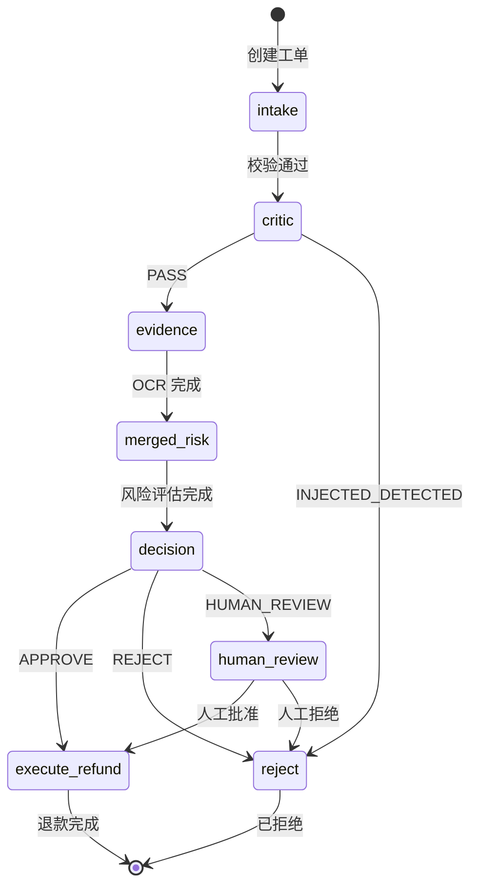
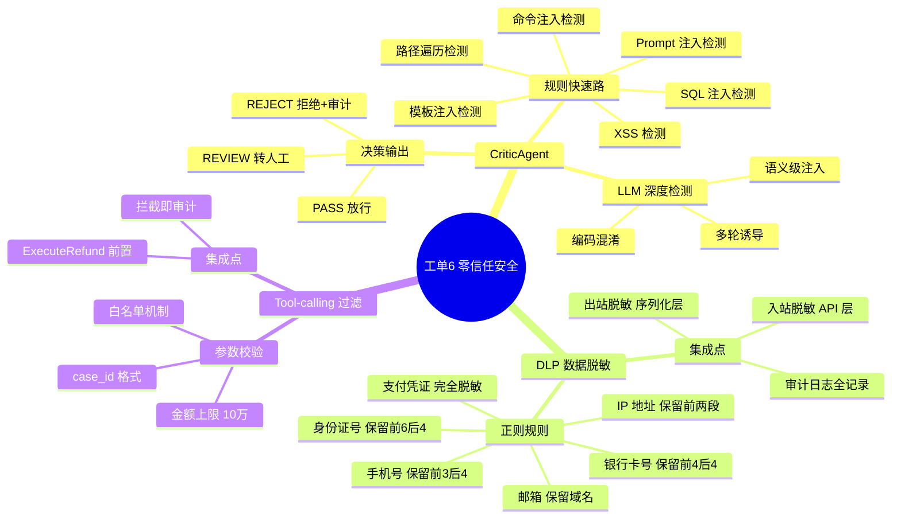

# 工单6（零信任安全防护与 AI 治理）合并方案设计

> **日期**: 2026-08-30
> **状态**: 设计文档

## 一、概述

### 1.1 目标

将工单6「企业级 Agent 零信任安全防护与 AI 治理系统」的三项核心能力合并到现有客诉退赔决策系统：

| 工单6 能力 | 合并策略 | 说明 |
|-----------|---------|------|
| **Critic Agent**（注入拦截） | 策略 B — 规则+LLM 双引擎 | 轻量规则快速路 + LLM 深层检测 |
| **DLP**（数据脱敏） | 策略 B — 正则+NER 混合 | 正则全覆盖 + 模型不参与运行时脱敏 |
| **Tool-calling 过滤** | 策略 C — 参数级校验 | 白名单 + 参数 Schema 校验 |

### 1.2 设计原则

- **零信任**：每一个入站请求、每一次 Agent 执行都视为不可信，显式验证
- **不改变现有工作流拓扑**：新节点作为可插拔的过滤层插入，不影响现有 Agent 逻辑
- **可观测性**：所有拦截/脱敏/过滤操作记录审计日志，可追溯
- **可配置**：阈值和白名单运行期可配置（复用 `system_config` 表）

---

## 二、架构设计

### 2.1 新增模块

```
backend/app/security/
├── __init__.py              # 导出 SecurityProvider
├── critic.py                # CriticAgent — 注入检测引擎
├── critic_rules.py          # 规则匹配器（快速路）
├── critic_llm.py            # LLM 深度检测（慢速路）
├── dlp.py                   # DLP 数据脱敏引擎
├── dlp_rules.py             # 正则规则集
├── tool_filter.py           # Tool-calling 参数校验器
├── dlp_models.py            # DLP 数据模型
├── provider.py              # SecurityProvider 统一接口
└── config.py                # 安全配置项
```

### 2.2 在 Workflow 中的位置

```
┌─────────────────────────────────────────────────────────────────┐
│                         LangGraph Workflow                      │
│                                                                 │
│  START → [IntakeAgent] → [CriticAgent*] → EvidenceAgent → ...  │
│                                    │                            │
│                          ┌─────────┴──────────┐                │
│                          │ 规则快速路 (inline)  │                │
│                          │ LLM 深度检测 (慢)    │                │
│                          └─────────┬──────────┘                │
│                           PASS/REJECT/REVIEW                    │
│                                                                 │
│  ... → DecisionPolicy → [ExecuteRefund] → END                   │
│                                     │                            │
│                             [ToolFilter*] 参数校验               │
│                             [DLP*] 数据脱敏                      │
│                                                                 │
└─────────────────────────────────────────────────────────────────┘
     * 新增模块
```

### 2.3 数据流

```
                 ┌───────────────────┐
                 │   API 请求        │
                 │   /api/v1/cases   │
                 └────────┬──────────┘
                          │
                          ▼
                 ┌───────────────────┐
                 │   DLP 脱敏        │  ← 请求体中的敏感字段即时脱敏
                 │   (dlp.sanitize)  │     写审计日志
                 └────────┬──────────┘
                          │
                          ▼
                 ┌───────────────────┐
                 │   CriticAgent     │  ← 注入检测（规则→LLM 二级）
                 │   (critic.check)  │     拦截结果写入 state.errors
                 └────────┬──────────┘
                          │
                  ┌───────┴───────┐
                  │  PASS         │  INJECTED_DETECTED
                  ▼               ▼
           [正常 Workflow]    [REJECT + 审计]
                  │
                  ▼
                 ┌───────────────────┐
                 │   ToolFilter      │  ← 执行退款前的参数校验
                 │   (tool_filter    │     白名单 + Schema 校验
                 │    .validate)     │
                 └────────┬──────────┘
                          │
                  ┌───────┴───────┐
                  │  VALID        │  INVALID
                  ▼               ▼
           [执行退款]        [拒绝 + 审计]
                  │
                  ▼
                 ┌───────────────────┐
                 │   DLP 脱敏输出    │  ← 返回给 API 调用方前脱敏
                 │   (dlp.sanitize)  │
                 └───────────────────┘
```

---

## 三、CriticAgent — 注入拦截

### 3.1 规则快速路（inline）

使用预编译正则规则集，O(1) 匹配，覆盖常见注入模式：

| 规则 | 模式 | 权重 |
|------|------|------|
| SQL 注入 | `SELECT.*FROM`, `DROP TABLE`, `UNION.*SELECT`, `' OR 1=1` | HIGH |
| XSS | `<script>`, `javascript:`, `onload=`, `<iframe` | HIGH |
| Prompt 注入 | `ignore previous instructions`, `system prompt:`, `你是一个`, `forget all` | HIGH |
| 路径遍历 | `../`, `..\\`, `/etc/passwd`, `C:\\Windows` | MEDIUM |
| 命令注入 | `; rm -rf`, `\`\`\``, `$(cat`, `cmd.exe`, `powershell` | HIGH |
| 模板注入 | `{{config}}`, `{{7*7}}`, `${7*7}` | MEDIUM |

### 3.2 LLM 深度检测（慢速路）

规则快速路 PASS 后，若 `critic_llm_enabled=true`，送 LLM 做语义级检测：

- 检测隐式注入（上下文无关的对抗性提示）
- 检测编码混淆（Base64、Unicode 变体）
- 检测多轮诱导（逐步引导 Agent 泄露信息）

### 3.3 Workflow 集成

CriticAgent 作为独立节点插入 IntakeAgent 之后、EvidenceAgent 之前：

```python
def check(state, deps) -> dict:
    result = deps.security.critic.check(
        text=state.get("complaint_text", ""),
        risk_flags=state.get("risk_flags", {}),
    )
    if result.action == "REJECT":
        # 写入审计日志，标记案件为 FAILED
        return {"errors": [f"CriticAgent: {result.reason}"]}
    if result.action == "REVIEW":
        # 标记需要人工复核
        return {"risk_flags": {**state.get("risk_flags", {}), "critic_review": True}}
    return {}
```

### 3.4 配置项

```python
critic_rule_enabled: bool = True       # 规则快速路开关
critic_llm_enabled: bool = False       # LLM 深度检测开关（默认关闭，按需开启）
critic_reject_on_high: bool = True     # HIGH 权重规则直接拒绝
critic_review_on_medium: bool = True   # MEDIUM 权重规则转人工
```

---

## 四、DLP — 数据脱敏

### 4.1 正则规则集

| 规则 | 模式 | 脱敏方式 | 示例 |
|------|------|---------|------|
| 身份证号 | `\d{17}[\dXx]` | 保留前6后4 | `110101******123X` |
| 手机号 | `1[3-9]\d{9}` | 保留前3后4 | `138****5678` |
| 银行卡号 | `\d{16,19}` | 保留前4后4 | `6222********1234` |
| 邮箱 | `[\w.+-]+@[\w-]+\.[\w.-]+` | 保留域名 | `***@example.com` |
| IP 地址 | `\d{1,3}\.\d{1,3}\.\d{1,3}\.\d{1,3}` | 保留前两段 | `192.168.*.*` |
| 支付凭证 | `pay_\w{16,}` | 完全脱敏 | `pay_********` |

### 4.2 架构

DLP 不参与运行时决策，仅作数据脱敏：

- **入站脱敏**：API 层接收请求后，将 `complaint_text` 中的敏感字段脱敏后再存入数据库
- **出站脱敏**：API 返回响应时，对 `ocr_text` / `complaint_text` 等字段脱敏
- **审计日志**：所有脱敏操作记录 `AuditLog`，含原始字段名和脱敏类型

### 4.3 集成点

```python
# 在 API 路由层（cases.py）的 create_case 中：
from ..security import dlp
body.complaint_text = dlp.sanitize(body.complaint_text)

# 在 _serialize_case 中，返回前脱敏：
case.complaint_text = dlp.sanitize(case.complaint_text)
```

### 4.4 配置项

```python
dlp_enabled: bool = True              # DLP 总开关
dlp_sanitize_input: bool = True       # 入站脱敏
dlp_sanitize_output: bool = True      # 出站脱敏
dlp_mask_char: str = "*"              # 脱敏字符
```

---

## 五、Tool-calling 过滤

### 5.1 设计

Tool-calling 过滤在退款执行前校验参数合法性。现有系统只有 `ExecuteRefund` 一个工具调用点（调用 `refund_provider.execute`），参数校验规则：

| 校验 | 规则 | 拦截条件 |
|------|------|---------|
| 金额上限 | `amount_cent <= 10000000`（10万元） | 超过上限拒绝 |
| 金额正数 | `amount_cent > 0` | 负数或零拒绝 |
| case_id 格式 | 匹配 UUID v4 格式 | 格式非法拒绝 |
| 幂等性 | 检查 Redis 锁 + 数据库状态 | 重复执行拒绝 |
| 白名单 | 仅允许 `execute` 和 `cancel` 两个操作 | 其他操作拒绝 |

### 5.2 集成点

```python
# 在 execute.py 中，调用 refund_provider.execute 前：
def run(state, deps):
    validation = deps.security.tool_filter.validate(
        tool_name="execute_refund",
        params={"case_id": state["case_id"], "amount_cent": state["amount_cent"]},
    )
    if not validation.valid:
        deps.record_agent_run(case_id, "ToolFilter", "BLOCKED",
                              error=validation.reason)
        raise ValueError(f"Tool-calling 被拦截: {validation.reason}")
    # ... 原有逻辑
```

### 5.3 配置项

```python
tool_filter_enabled: bool = True
tool_filter_amount_max: int = 10000000  # 10万元（分）
tool_filter_allowed_tools: list = ["execute_refund", "cancel_refund"]
```

---

## 六、SecurityProvider 统一接口

### 6.1 Provider 接口

```python
@dataclass
class CriticResult:
    action: str  # PASS / REJECT / REVIEW
    reason: str = ""
    matched_rules: list = field(default_factory=list)

@dataclass
class ValidationResult:
    valid: bool
    reason: str = ""

class SecurityProvider:
    def __init__(self, db=None, tracer=None):
        self.critic = CriticEngine(db, tracer)
        self.dlp = DLPEngine()
        self.tool_filter = ToolFilter()
```

### 6.2 DI 容器集成

在 `container.py` 的 `Deps` 类中新增 `self.security` 属性：

```python
class Deps:
    def __init__(self, redis_client, checkpointer=None):
        # ... 原有初始化
        self.security = SecurityProvider()
```

---

## 七、配置变更

在 `config.py` 中新增：

```python
# ── 安全配置（工单6：零信任安全防护与 AI 治理）──
critic_rule_enabled: bool = True
critic_llm_enabled: bool = False
critic_reject_on_high: bool = True
critic_review_on_medium: bool = True

dlp_enabled: bool = True
dlp_sanitize_input: bool = True
dlp_sanitize_output: bool = True
dlp_mask_char: str = "*"

tool_filter_enabled: bool = True
tool_filter_amount_max: int = 10000000
```

在 `config_store.py` 的 `THRESHOLD_KEYS` 中新增可运行期覆盖的安全阈值。

---

## 八、数据库变更

新增 `SecurityAuditLog` 表（可选，可复用现有 `AuditLog` 表 + 新增 `action` 前缀）：

| 操作 | AuditLog.action 前缀 |
|------|---------------------|
| Critic 拦截 | `critic:blocked` |
| DLP 脱敏 | `dlp:sanitized` |
| ToolFilter 拦截 | `toolfilter:blocked` |

复用现有 `AuditLog` 表，不新增表。

---

## 九、Workflow 图变更

### 9.1 新增节点



### 9.2 安全体系思维导图



---

## 十、评测体系影响

### 10.1 Golden Dataset 扩展

现有 10 条用例扩展至 13 条，新增 3 条安全场景：

| # | 场景 | 预期决策 | 安全校验 |
|---|------|---------|---------|
| 11 | 投诉文本含 SQL 注入标记 | REJECT | CriticAgent 规则拦截 |
| 12 | 投诉文本含 Prompt 注入 | REJECT | CriticAgent 规则拦截 |
| 13 | 退款金额超 10 万 | REJECT | ToolFilter 参数拦截 |

### 10.2 评测维度扩展

在现有 3 维度基础上新增「安全拦截正确性」维度（可选，20pt），总分 120pt。但为保持向后兼容，默认不启用，仅在 `--security` 标志下开启。

---

## 十一、实施计划

### Phase 1: 基础模块（~2h）
1. 创建 `backend/app/security/` 包结构
2. 实现 `DLPEngine`（正则规则 + sanitize 方法）
3. 实现 `CriticEngine` 规则快速路
4. 实现 `ToolFilter` 参数校验器
5. 实现 `SecurityProvider` 统一接口

### Phase 2: Workflow 集成（~1h）
6. 在 `config.py` 新增安全配置
7. 在 `container.py` 注入 `SecurityProvider`
8. 在 `graph.py` 新增 `critic` 节点
9. 在 `execute.py` 集成 `ToolFilter`
10. 在 API 层集成 DLP（入站/出站）

### Phase 3: 文档与评测（~1h）
11. 更新 `答辩文档.md`（新增工单6章节）
12. 更新 `流程图与思维导图.md`（新增安全层图）
13. 更新 Golden Dataset（新增 3 条安全用例）