# 客诉舆情退赔决策系统 — 流程图 & 思维导图

---

## 一、总体流程图

### 1.1 工作流状态机

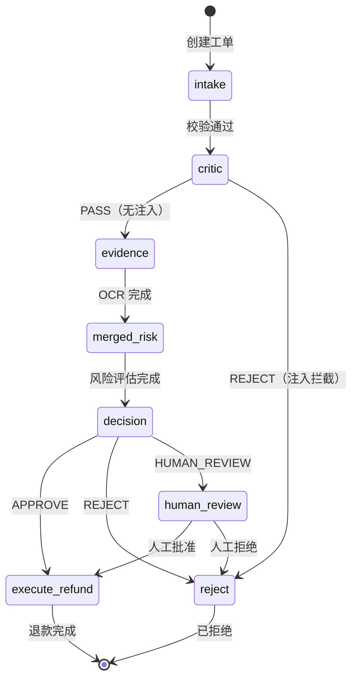

### 1.2 决策规则引擎流程

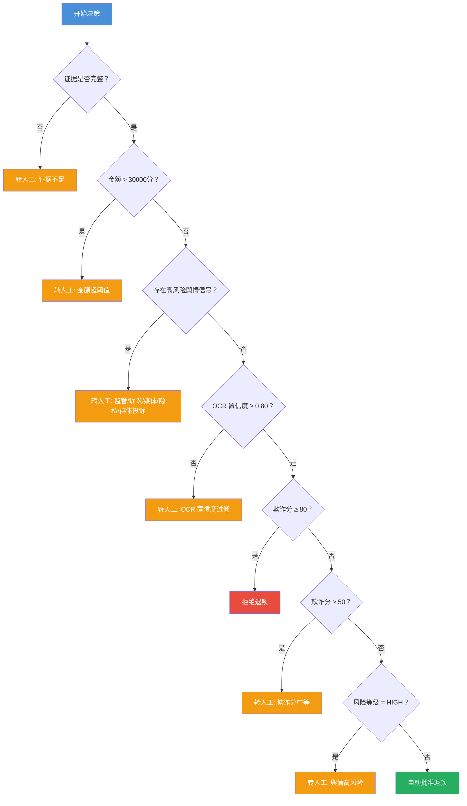

### 1.3 安全层流程图（工单6）

#### 1.3.1 CriticAgent 注入检测流程

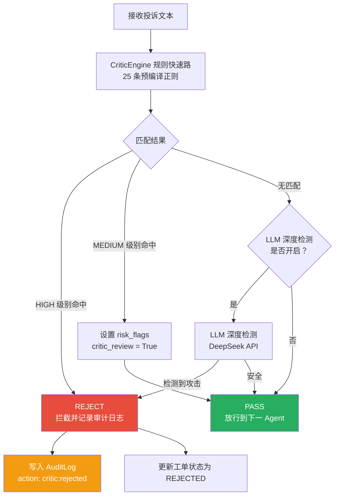

#### 1.3.2 DLP 数据脱敏流程

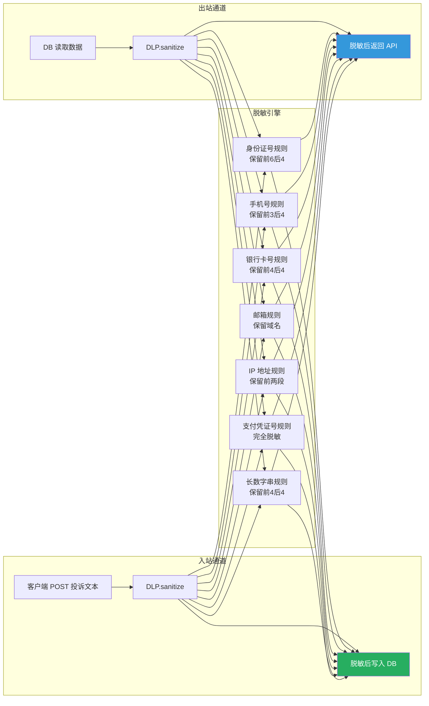

#### 1.3.3 ToolFilter 参数校验流程

```mermaid
flowchart TD
    Start[ExecuteAgent 发起退款请求] --> ToolFilter[ToolFilter.validate]
    ToolFilter --> Whitelist{工具在白名单中？}
    Whitelist -->|否| Blocked[BLOCKED<br/>未注册工具]

    Whitelist -->|是| TypeCheck{参数类型匹配？}
    TypeCheck -->|否| Blocked

    TypeCheck -->|是| AmountCheck{amount_cent<br/>∈ [1, 10_000_000]？}
    AmountCheck -->|否| Blocked

    AmountCheck -->|是| UUIDCheck{case_id<br/>为合法 UUID？}
    UUIDCheck -->|否| Blocked

    UUIDCheck -->|是| Pass[✅ 校验通过<br/>执行退款]

    Blocked --> AuditLog[写入 AuditLog<br/>action: toolfilter:blocked]
    Blocked --> RaiseError[抛出 ValueError<br/>终止执行]

    style Pass fill:#27ae60,color:#fff
    style Blocked fill:#e74c3c,color:#fff
    style AuditLog fill:#f39c12,color:#fff
```

#### 1.3.4 三层安全防线总览

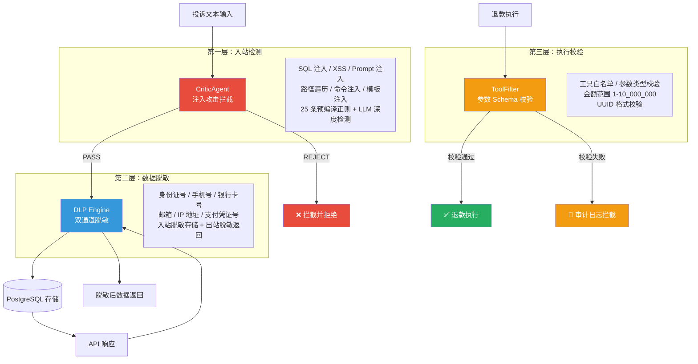

### 1.4 系统总体架构（含安全层）

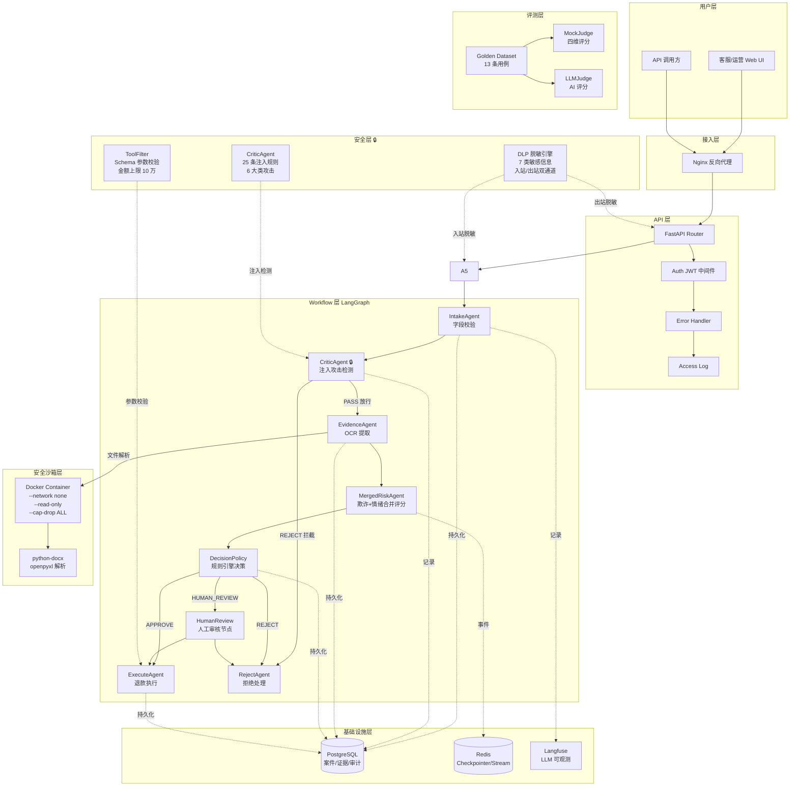

### 1.4 部署架构

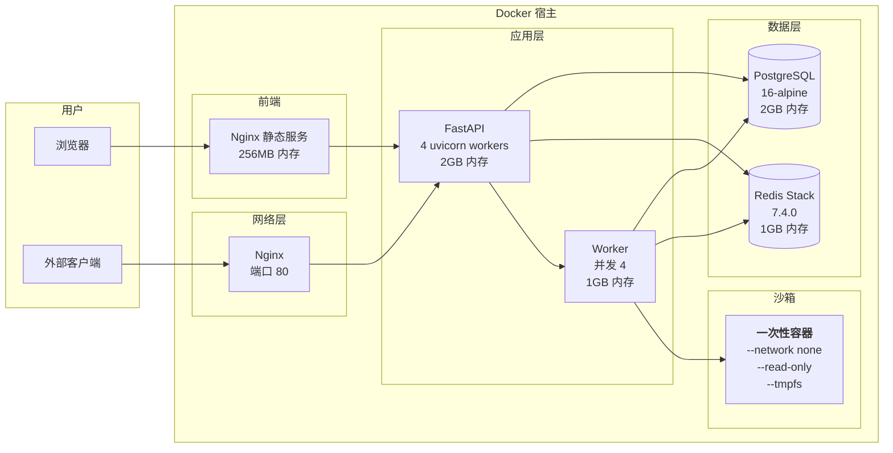

### 1.5 合并评分优化（成本优化对比）

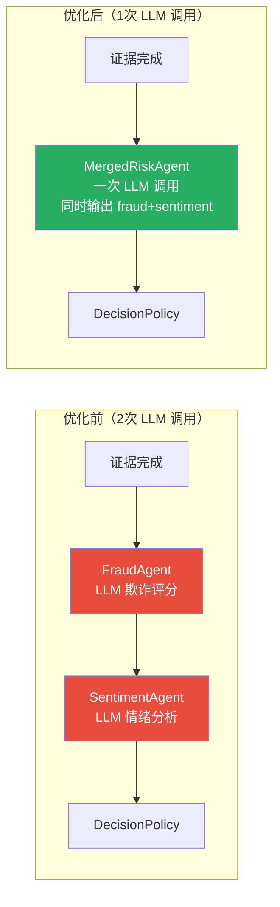

### 1.6 批量审批流程

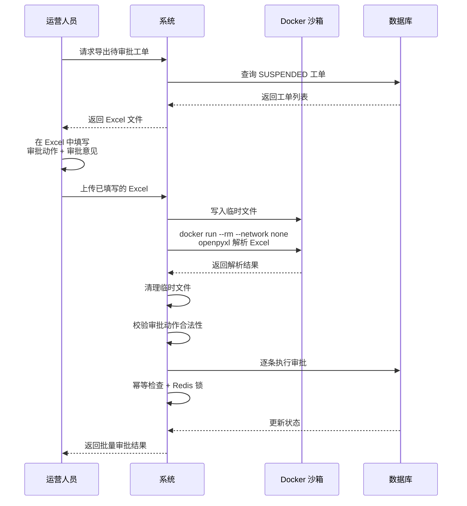

### 1.7 评测流程

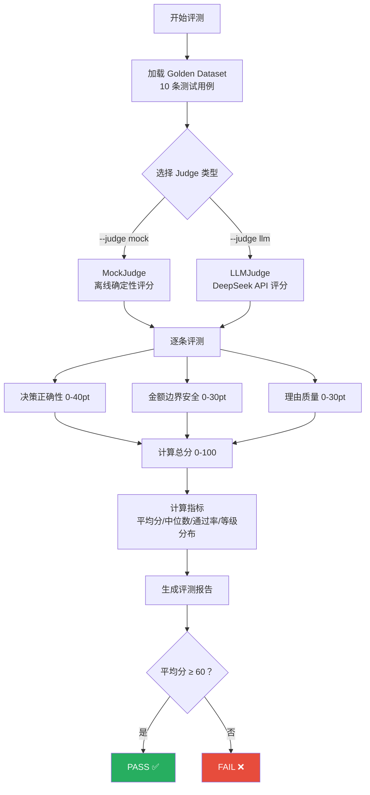

---

## 二、思维导图

### 2.1 项目全景思维导图

```mermaid
mindmap
  root((客诉舆情退赔决策系统))
    架构设计
      API 层
        FastAPI 路由
        JWT 认证中间件
        异常处理
        访问日志
        DLP 入站脱敏
      Workflow 层
        LangGraph 状态机
        7 个 Agent + CriticAgent
        条件路由分支
      Infra 层
        PostgreSQL 事务
        Redis 缓存/事件
        Langfuse 观测
    安全体系
      Docker 沙箱
        --network none 禁网
        --read-only 只读
        --cap-drop ALL 最小权限
        --tmpfs 内存临时文件
        --user 1000:1000 非 root
        一次性容器用完即焚
      LLM 不接触资金决策
        规则引擎终判
        6 条确定性规则链
        阈值可配置
      零信任安全 🔒
        CriticAgent 注入拦截
          25 条规则 6 大类
          规则快速路 + LLM 深度
        DLP 数据脱敏
          7 类敏感信息
          入站/出站双通道
        ToolFilter 参数校验
          Schema 白名单
          金额上限 10 万
    成本优化
      合并评分
        一次调用双输出
        减少 50% LLM 调用
        上下文共享省 Token
        Mock/LLM 双模式
    评测体系
      Golden Dataset
        13 条用例
        11 种典型场景
        预期决策标注
      四维度评分
        决策正确性 40pt
        金额边界安全 20pt
        理由质量 20pt
        安全拦截 20pt
      MockJudge
        离线确定性
        CI 集成快速验证
      LLMJudge
        DeepSeek API
        深度推理评分
    技术栈
      后端
        FastAPI + Pydantic
        SQLAlchemy + Alembic
        LangGraph
        Redis + PostgreSQL
      前端
        React 18
        TypeScript
        Ant Design 5
        Vite 构建
      容器
        Docker Compose
        5 服务编排
        Nginx 反代
      模型
        DeepSeek
        通义千问
        Ollama 本地部署
    痛点改进
      评测未接真实 Workflow
        接入 graph.invoke()
        改进前
      MockJudge 粒度粗
        引入替代决策概念
        二值改三级评分
      沙箱镜像无版本
        语义化版本标签
        CI 自动构建
      无压测数据
        Locust 脚本
        PostgreSQL 连接池
        Redis 消费延迟
      阈值配置不便捷
        管理后台可视化
        变更审计日志
```

### 2.2 Agent 协作思维导图

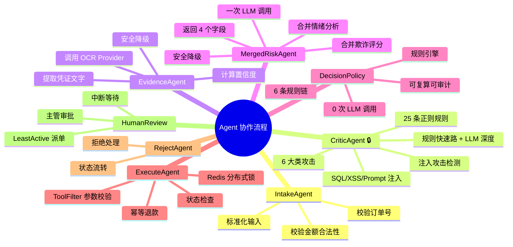

### 2.3 数据流转思维导图

```mermaid
mindmap
  root((数据流转))
    输入数据
      工单信息
        订单号
        金额
        投诉文本
        风险信号
      凭证文件
        Word
        Excel
        图片
    中间数据
      OCR 结果
        文本内容
        置信度
      Risk 评估
        fraud_score 0-100
        sentiment_score 0-100
        risk_level LOW/MED/HIGH
        risk_factors[]
    持久化数据
      PostgreSQL
        RefundCase 案件表
        CaseEvidence 证据表
        RiskAssessment 风险评估
        AgentRun 执行记录
        AuditLog 审计日志
        ReviewTask 审批任务
      Redis
        Checkpointer 断点
        Stream 消息队列
        Pub/Sub 事件
```

---

## 三、关键数据流

### 3.1 工单完整生命周期

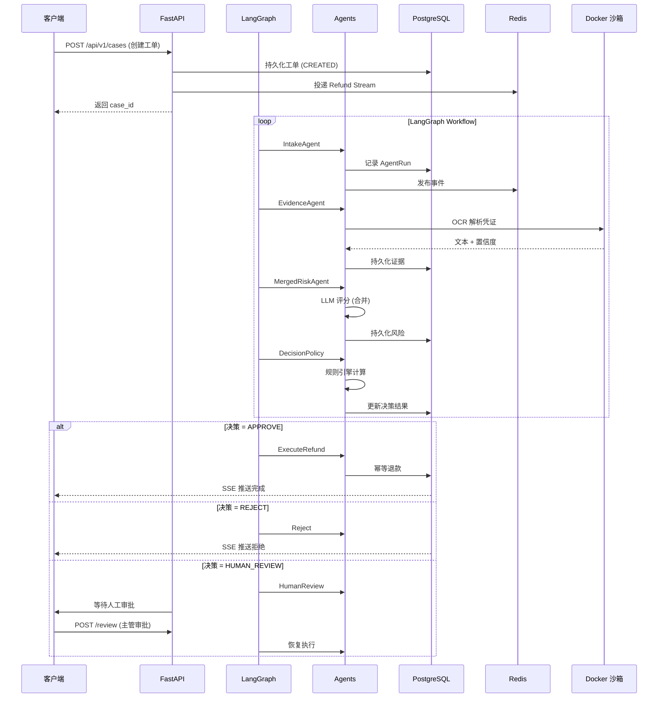

---

> **文件版本**：v2.0  
> **生成日期**：2026-08-30  
> **说明**：本文档从答辩文档中独立提取流程图和思维导图，方便单独展示和打印。v2.0 新增工单6 安全层内容（CriticAgent 注入检测、DLP 数据脱敏、ToolFilter 参数校验）。